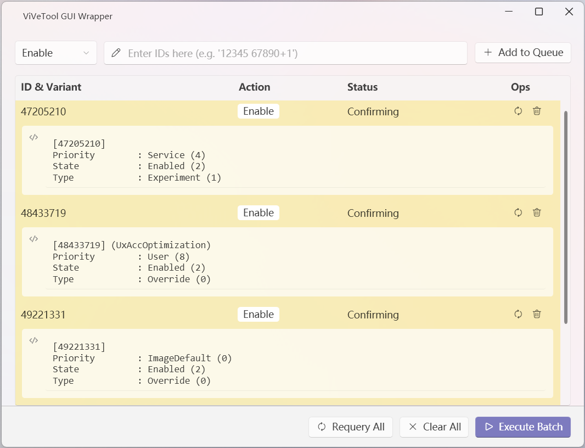

# ViveGui

轻量的 [Vivetool](https://github.com/thebookisclosed/ViVe) 图形前端，提供图形化的操作和信息显示。特点：
- 从系统 path 环境变量查找 vivetool，实现前后端彻底分离。
- 在提供图形化的操作结果显示的同时，保留了 vivetool 的命令行输出。
- 在程序内维护一份操作列表，可以指定功能 ID 和要执行的操作。在决定批量应用操作前，可以删除单个或所有功能 ID 项。
- 将功能 ID 加入列表时自动执行状态查询查询。
- 单文件发布，便于分发和使用。
- 通过 WPF-UI 实现现代化的界面，支持Mica效果。

## 界面截图

## 详细信息

- 基本操作
    - 本程序支持 `query` `enable` `reset` 三种操作，通过输入框左侧的下拉菜单指定将执行的操作。
    - 本程序将“维护操作列表”和“执行批量操作”分离，用户先通过 `Add to Queue` 按钮将功能 ID 及其对应的操作添加入操作列表，再点击 `Execute Batch` 按钮批量执行操作。
    - 在决定批量执行操作前，用户还可通过按钮删除单个 ID 项，或通过 `Clear Queue` 按钮清空整个操作列表。
- 操作列表
    - 以任意操作模式添加 ID 时，程序均会自动执行 `query` 操作，并显示当前状态。显式指定以 `query` 模式添加 ID 时，该 ID 项会被标记为 `Skipped`，表示该项不会在批量执行时被处理。
    - 指定其他操作时，ID 项会被标记为 `Confirmming`；操作执行完成后，视结果成功与否，ID 项会被标记为 `Confirmed` 或 `Error`。
    - 所有标记都有对应的颜色指示。
- 输入输出
    - 支持使用 `{ID}+{variant}` 的形式指定功能 ID 的变体，惟 ID 和 variant 之间不能有空格；支持一次输入多个 ID，ID 之间可以用空格、逗号、混用空格与逗号分隔。
    - 重复输入相同的 ID 时，后输入的操作类型会覆盖前一次的操作类型。
    - 操作列表中的每一个 ID 项都会显示 vivetool 的最近一次输出，方便用户查看详细信息。

## 注意事项

- 本程序未附带 ViveTool，用户需自行寻找、下载并配置 path 环境变量。
- 本程序虽为单文件发布，但未包含运行时，用户需自行安装 .NET 10 桌面运行时。
- 由于 ViveTool 的使用需获取管理员权限，本程序将首先自动请求该权限，以确保所有操作的顺利执行。

> [!Warning]
> 由于使用了 WPF-UI 并通过它开启了 Mica 效果，本程序已验证无法在 Windows 10 上运行。

## 更新历史

- v1.0.0 首个稳定可用版本
- v1.1.1 增加深色模式支持
- v1.2.0 更新依赖。

> [!Note]
> v1.2.0: 当前版本对 WPF-UI (v4.2.0) 的 ContentDialogHost 功能缺乏支持。因此，移除了操作执行后的对话框提示。

## 许可证
[MIT License](LICENSE.txt)
